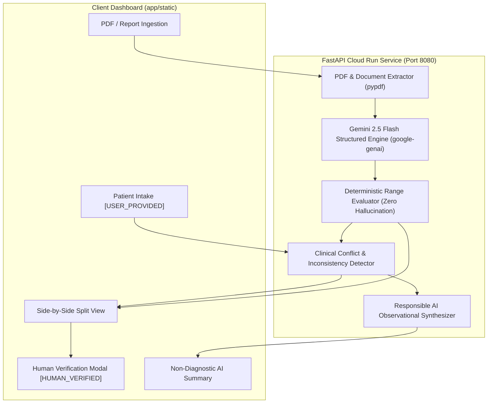

# MedLens — AI-Powered Clinical Information Intelligence

[](https://cloud.google.com/run)
[](https://fastapi.tiangolo.com)
[](https://ai.google.dev)
[](https://docs.pytest.org)

> **MedLens** transforms fragmented, unstructured medical records, laboratory PDFs, and patient intake forms into structured, verifiable, and clinical-grade intelligence with **zero reference-range hallucination**, full source provenance, and human-in-the-loop review.

---

## 🌟 Key Innovations & Hackathon Feature Checklist

| Requirement / Feature | Status | MedLens Implementation |
|---|---|---|
| **Patient Information Intake** | ✅ Complete | Captures age, sex, symptoms, diagnosed conditions, allergies, and medications with `[USER_PROVIDED]` provenance tags. |
| **Medical Report Processing** | ✅ Complete | Ingests PDF and text lab reports using `pypdf` and Gemini 2.5 Flash with structured Pydantic extraction. |
| **Reference-Range Awareness** | ✅ Complete | **Strict Zero-Hallucination Engine**: Identifies LOW / NORMAL / HIGH strictly from source-stated reference ranges. If no range is in the source, marks `UNKNOWN` without guessing standards. |
| **Source Provenance & Audit** | ✅ Complete | Every data point displays an exact verbatim text snippet and badge (`[USER_PROVIDED]`, `[AI_EXTRACTED]`, `[HUMAN_VERIFIED]`). |
| **Responsible AI Summary** | ✅ Complete | Observational, non-diagnostic patient-friendly summary with permanent safety disclaimer; forbids diagnostic claims or prescribing. |
| **Inconsistency & Conflict Engine** | 🏆 Bonus | Cross-references reported history against lab findings (e.g., elevated glucose without diabetes history, penicillin allergy conflicts). |
| **Human-in-the-Loop (HITL) Verification** | 🏆 Bonus | Clinicians can edit values, calibrate ranges, and approve findings with `[HUMAN_VERIFIED]` audit tags. |
| **Side-by-Side Review UI** | 🏆 Bonus | Split-screen showing verbatim report transcript on the left and structured observations on the right. |
| **1-Click Judge Demo Mode** | 🏆 Bonus | Preloaded clinical scenario (`⚡ Load Demo Case`) allowing judges to evaluate the entire pipeline in 5 seconds. |
| **Cloud Run Deployment** | 🏆 Bonus | Optimized single-container Dockerfile and GitHub Actions CI/CD pipeline on port 8080. |

---

## 🏗️ System Architecture



---

## 🛡️ Safety & Responsible AI Architecture

1. **Non-Diagnostic Framing**: System prompts and deterministic rules strictly prohibit diagnostic labeling (e.g., *"Patient has diabetes"* is rejected in favor of *"Observed Fasting Glucose of 158 mg/dL is flagged above the report's reference range"*).
2. **Zero Hallucination Rule**: When laboratory reports omit reference ranges, MedLens marks them as `UNKNOWN` with an explicit audit note rather than substituting statistical population averages.
3. **Persistent Clinical Disclaimer**: A prominent medical banner is displayed at the top of every screen and embedded within all exports.
4. **Human-in-the-Loop Override**: Clinicians maintain final authority to adjust values or confirm observations before formal clinical records are saved.

---

## 🚀 Quick Start (Local Development)

### 1. Prerequisites
- Python 3.11+ (or Astral `uv`)
- Optional: `GEMINI_API_KEY` (MedLens includes a built-in deterministic clinical parser if no key is supplied)

### 2. Setup Environment
```bash
# Clone the repository
git clone https://github.com/YOUR_USERNAME/MedLens.git
cd MedLens

# Create and activate virtual environment
python -m venv .venv
source .venv/bin/activate  # On Windows: .venv\Scripts\activate

# Install dependencies
pip install -r requirements.txt
```

### 3. Run Automated Tests
```bash
pytest tests/ -v
# Output: 11 passed
```

### 4. Start the Application
```bash
uvicorn app.main:app --host 127.0.0.1 --port 8080 --reload
```
Open **`http://localhost:8080`** in your browser!

Click **`⚡ Load Demo Case`** to immediately experience:
- Patient intake with `[USER_PROVIDED]` badges
- Extracted Complete Blood Count & Comprehensive Metabolic Panel
- Automated conflict alerts (hyperglycemia without diabetes history)
- Observational clinical summary

---

## ☁️ Google Cloud Run Deployment Guide

### Option 1: Automated CI/CD via GitHub Actions
1. In your GitHub repository, navigate to **Settings > Secrets and variables > Actions**.
2. Add the following secrets:
   - `GCP_PROJECT_ID`: Your Google Cloud Project ID.
   - `GCP_SA_KEY`: The JSON key of your deployment service account.
   - `GEMINI_API_KEY`: Your Google Gemini API Key.
3. Push your code to the `main` branch:
```bash
git add .
git commit -m "Deploy MedLens to Cloud Run"
git push origin main
```
4. GitHub Actions will execute the test suite, build the Docker container, push to Artifact Registry, and deploy to Cloud Run!

### Option 2: Direct Deployment via Google Cloud CLI (`gcloud`)
```bash
# 1. Enable required GCP services
gcloud services enable run.googleapis.com artifactregistry.googleapis.com

# 2. Build and deploy directly to Cloud Run
gcloud run deploy medlens-api \
    --source . \
    --region us-central1 \
    --port 8080 \
    --allow-unauthenticated \
    --set-env-vars GEMINI_API_KEY=YOUR_KEY_HERE
```

---

## 📂 Project Structure
```
medlens/
├── .github/
│   └── workflows/
│       └── deploy.yml            # CI/CD Cloud Run pipeline
├── app/
│   ├── models/
│   │   └── schemas.py            # Pydantic domain models & provenance schemas
│   ├── services/
│   │   ├── extractor.py          # Gemini 2.5 Flash & fallback clinical parser
│   │   ├── inconsistency_engine.py # Clinical conflict detection
│   │   ├── range_evaluator.py    # Zero-hallucination deterministic range evaluator
│   │   └── summarizer.py         # Responsible AI observational summarizer
│   ├── static/
│   │   ├── app.js                # Interactive HITL frontend client
│   │   ├── index.html            # Tailwind + Lucide single-page interface
│   │   └── styles.css            # Custom styling & print media rules
│   ├── __init__.py
│   └── main.py                   # FastAPI application entrypoint
├── sample_data/
│   ├── sample_cbc_metabolic.txt  # CBC & Metabolic Panel test case
│   └── sample_lipid_cardiac.txt  # Lipid & Cardiovascular test case
├── tests/
│   ├── test_api.py               # API route integration tests
│   ├── test_inconsistency.py     # Conflict detection unit tests
│   └── test_range_evaluator.py   # Reference range logic unit tests
├── .dockerignore
├── .env.example
├── .gitignore
├── Dockerfile                    # Production Cloud Run container
├── requirements.txt
└── README.md
```

---

## 📄 License & Attribution
Developed for the MedLens Clinical Information Intelligence Hackathon. Licensed under the Apache 2.0 License.
